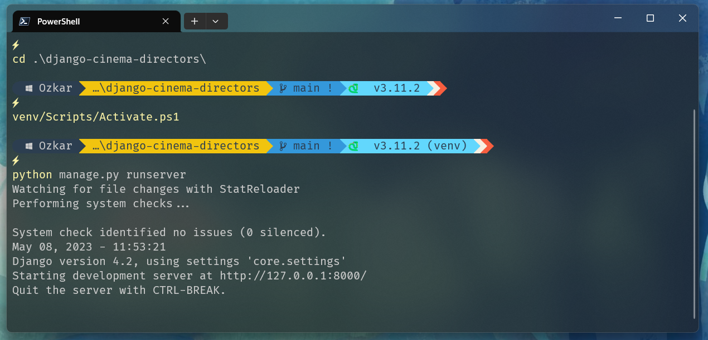

# starship-toml template 🚀


## Prompt preview



Please check first if you have FiraCode NF font installed.

## Installation guide:

Please raise an issue/comment if you spot anything!

1. Install Windows Terminal. If you using cmd.exe, unfortunately it doesn't display unicode emojis correctly. You can run PowerShell from [Windows Terminal](https://github.com/microsoft/terminal).
2. Download a Nerd font. I went for FiraCode Nerd Font Mono. Unzip and install the font. Also you could patch your self font with the script provided by NerdFonts.
3. Activate the font in Windows Terminal (left click > settings > Profiles (Command Prompt) > Additional Settings (Appearance) > Select the font you just installed).
4. At this point, you should restart your computer to make sure the changes have taken place.
5. install [Starhips](https://starship.rs) and then add ```starship.toml``` to ```$HOME/.config/``` and reload your terminal.

[NerdFonts repository](https://github.com/ryanoasis/nerd-fonts)
---
[Starship documentation](https://starship.rs/guide/#%F0%9F%9A%80-installation)

- Terminal Font: **FiraCode Nerd Font Mono**